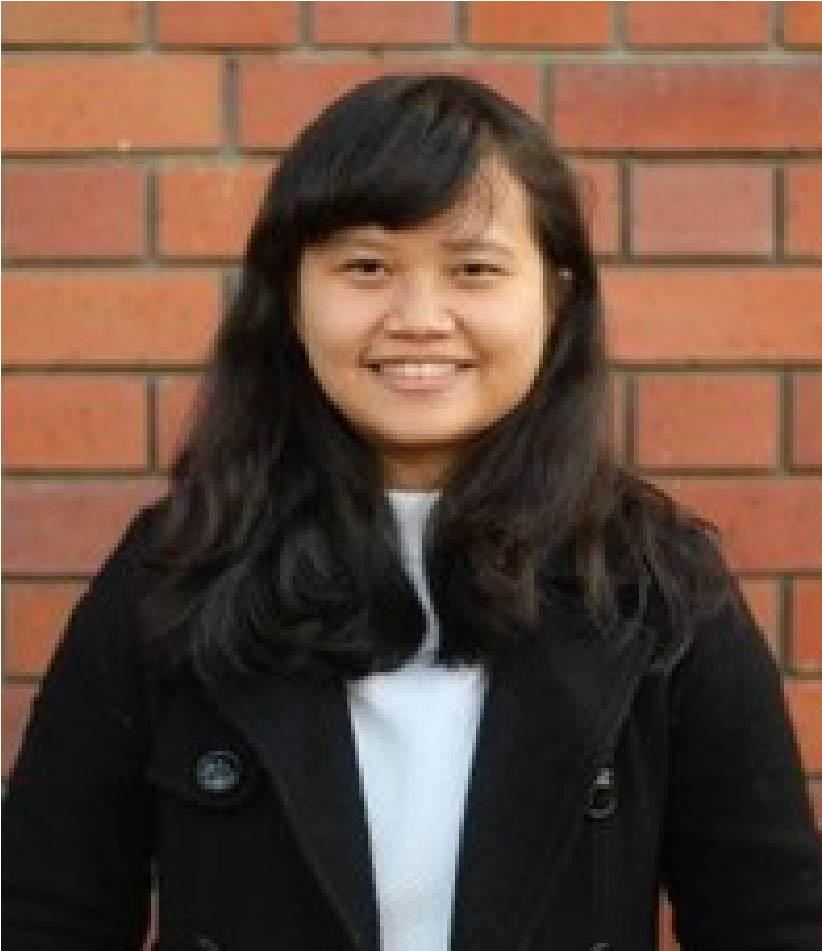

Aside
================================================================================

{width=100%}

Contact {#contact}
--------------------------------------------------------------------------------

- <i class="fa fa-envelope"></i> erawijantari@gmail.com
- <i class="fa fa-envelope"></i> erawijantari.p.aa@m.titech.ac.jp
- <i class="fa fa-twitter"></i> [erawijantaript](https://twitter.com/erawijantaript)
- <i class="fa fa-github"></i> [github.com/erawijantari](https://github.com/erawijantari)
- <i class="fa fa-link"></i> [erawijantari.github.io](erawijantari.github.io)
- <i class="fa fa-phone"></i> +81 3-5734-3591

Skills {#skills}
--------------------------------------------------------------------------------
 
<i class="fab fa-python"></i> `Python`

<i class="fab fa-r-project"></i> `R`

<i class="fas fa-code-branch"></i> `Git`

<i class="fas fa-terminal"></i> `Bash`

<i class="fab fa-linux"></i> `Unix/Linux`

<i class="fas fa-server"></i> `HPC (SGE)`

 
 

Experienced in computational bioinformatics and biostatistics applied for next-generation sequencing data integrated to other omics analysis, especially for microbiome study. 

Disclaimer {#disclaimer}
--------------------------------------------------------------------------------
This resume was made with the R package [**pagedown**](https://github.com/rstudio/pagedown).  
 

Source code available at: [github.com/erawijantari/cv](https://github.com/erawijantari/erawijantari.github.io/static/cv_era). 
 

Last updated on 2019-12-22.

Main
================================================================================

Pande Putu Erawijantari {#title}
--------------------------------------------------------------------------------

 Interested in applying bioinformatics analysis on the complex multi-omics data such as metagenomic, metabolomic, and metatranscriptomic. Current research mainly focus on the dynamics of human gut microbiome in the gastrointestinal-related diseases and its association to treatment effectiveness.  

Education {data-icon=graduation-cap data-concise=true}
--------------------------------------------------------------------------------

### PhD Candidate-Life Science and Technology

Tokyo Institute of Technology

Tokyo JP

Present - 2017

- **Research project**: Multi-omics analysis gut microbiome
- **Skills learned**: Multi-omics integration, Biostatistic, Machine learning

### M.Sc-Biological Information

Tokyo Institute of Technology

Tokyo JP

2017 - 2015

- **Research project**: Gut microbiome in gastrointestinal related diseases",**Skills learned**: Metagenomics analysis pipeline, Biostatistic

### B.Sc-Biology

Institut Teknologi Bandung

Bandung ID

2014 - 2010

- **Research project**: Gene mutagenesis isolated from deep sea metagenome
- **Skills learned**: Site-directed mutagenesis, Genetic engineering, Protein expression, Enzyme kinetic

Selected Publications {data-icon=book-open}
--------------------------------------------------------------------------------

### **Influence of gastrectomy for gastric cancer treatment on faecal microbiome and metabolome profiles**

**Erawijantari PP**, Mizutani S, Shiroma H, Shiba S, Nakajima T, Sakamoto T, Saito Y, Fukuda S , Yachida S, Yamada T. *Gut*. In-press.

N/A

2019

 

### **Anti-inflammatory effect of mangosteen (Garcinia mangostana L.) peel extract and its compounds in LPS-induced RAW264.7 cell**

Widowati W, Darsono L, Suherman J, Fauziah N, Maesaroh M, **Erawijantari PP**. *Nat Prod Sci* 22(3):147-153.

N/A

2016

 

### **In vitro study of Myristica fragrans seed (Nutmeg) ethanolic extract and quercetin compound as anti-inflammatory agent**

Dewi K, Widyarto B, **Erawijantari PP**, Widowati W. *Int J Res Med Sci* 3 (9), 2303-2310.

N/A

2015

 

Selected conferences {data-icon=group}
--------------------------------------------------------------------------------

### **Fecal microbiome and metabolome characterizations of patients after gastrectomy for gastric cancer treatment**

**Erawijantari PP**, Mizutani S, Shiroma H, Yachida S, Yamada T. Keystone Symposia on Molecular and Cellular Biology: Microbiome: Therapeutic Implications (T1).**Poster**.

N/A

October, 2019

 

### **Metagenomic and metabolomic profiling to characterize the effect of gastrectomy as gastric cancer treatment on human gut microbiome**

**Erawijantari PP**, Mizutani S, Shiroma H, Yachida S, Yamada T. 7th International Human Microbiome Consortium : Translating microbiome science. **Poster**.

N/A

June, 2018

- *Selected as Early Career Scientist Bursary Recipient*

Teaching Experiences {data-icon=chalkboard-teacher}
--------------------------------------------------------------------------------
::: aside
I am passionate about teaching because I always learn something new from it. Designing the course and effective teaching approach are very challenging process that I mostly enjoyed.
:::

### **Initiator and Tutor for RPyID Session**

Local community of Indonesian in Tokyo Institute of Technology

Tokyo JP

Present - 2019

- Introductions of R and Python for data analysis
- Designing the biweekly meeting course and discussion
- Sites: [RPyID-GitHub](https://github.com/erawijantari/RPyId)

### **Teaching Asistant-International Bio-Creative Design**

School of Life Science and Technology, Tokyo Tech

Tokyo JP

2018

- Tutor for discussion using topic from “The Breakthrough of the year” selected by the Journal “Science”
- Sites: [International Bio-Creative Design](http://www.ocw.titech.ac.jp/index.php?module=General&action=T0300&JWC=201924065&lang=EN)

### **Research Asistant-LST Bioleader Training 1**

School of Life Science and Technology, Tokyo Tech

Tokyo JP

2017

- Supervising one of master student's project in the laboratory
- Sites: [LST Bioleader Training 1](http://www2.ocw.titech.ac.jp/index.php?module=General&action=T0300&GakubuCD=5&GakkaCD=352424&KeiCD=24&course=24&KougiCD=201703118&Nendo=2017&lang=EN&vid=03)

Selected awards {data-icon=trophy}
--------------------------------------------------------------------------------

### **Japanese Government (Monbukagakusho:MEXT) Scholarship recipient**

Awarded to foreign students who study in higher education institutions, selected on the recommendation of Japanese Embassy/Consulate General, University, or Authority.

N/A

2020 - 2015

 

### **International Human Microbiome Consortium 2018 Early Career Scientist Bursary Recipient**

Conference travel grant available to 12 scientists works on human microbiome research.

N/A

2018

 

### **Gold medalist as ITB_Indonesia team on iGEM (International Genetically Engineered Machine)**

The project title: Ecoliplaster :cell biocatalyst for PET plastic degradation using E. coli.

N/A

2014

 

Work experiences {data-icon=suitcase}
--------------------------------------------------------------------------------
::: aside
### REFERENCE

**TAKUJI YAMADA**\
Associate Professor\
School of Life Science and Technology\
Tokyo Institute of Technology, Tokyo, JP\
+813-5734-3629, takuji@bio.titech.ac.jp
:::

### **Student Intern-Data Analyst**

Metabologenomics, Inc.

Tokyo JP

Present - 2018

- Contribute as data analyst and metagenomic pipeline development

### **Research Assistant**

Yamada Laboratory-Tokyo Institute of Technology

Tokyo JP

Present - 2017

- Primarly working on the gut microbiome and metabolome profiling for gastrectomy patients
- Contribute to data analysis on hereditary colorectal cancer project
- Contribute to the methods development for the eukaryotic fraction detection and metagenomics analysis pipeline

### **Research Scientist**

Biomolecular and Biomedical Research Center, Aretha Medika Utama

Bandung ID

2015 - 2014

- Carried out analyses on the phytochemical bioactive screening and the potential of Mesenchymal Stem Cells for cancer treatment using human cells line model
